# Why we review this way

Our documents are written in Markdown, stored in GitHub, and reviewed through Pull Requests (PRs) instead of passing Word files around by email or sharing copies on SharePoint sites.

- **One source of truth.** There is one copy of each document, in the repository. There are no "v3_final_JM_reviewed.docx" files.
- **Comments are tied to exact sentences.** Each comment is attached to the line it talks about, so nobody has to guess what "the second paragraph on page 4" means.
- **Suggestions work like tracked changes.** A reviewer can propose new wording, and the author accepts it with one click.
- **Full history.** GitHub records who proposed, reviewed, approved and published every change, and when.
- **The published files always match the approved text.** The PDF and DOCX are generated automatically from the approved Markdown, never edited by hand.
- **You don't need to know Git.** Reviewers and authors only use the GitHub website.
- **Everything happens in the browser.** You don't need to install anything.

## The process at a glance

1. The author writes or changes a document on a separate branch and opens a Pull Request.
2. GitHub builds the PDF and DOCX for that version automatically.
3. Reviewers read the document, comment on specific lines, and propose wording.
4. Reviewers submit their verdict: **Comment**, **Request changes**, or **Approve**.
5. The author answers, applies suggestions, fixes the rest, and resolves each conversation.
6. The reviewer checks only what changed and approves.
7. The author merges. GitHub builds the final PDF and DOCX from `main`.

`main` is protected. Nothing can be merged without at least one approval and with every conversation resolved.

## The worked example

All screenshots in this guide come from a real review in this repository: [Pull Request #1, "Add sample Information Security Policy"](https://github.com/jmizquierdo/docs-review-sandbox/pull/1).

- **Author:** `jmizquierdo`
- **Reviewer:** `heydolon`
- **Document:** `docs/sample-policy.md`

The document had four planted mistakes:

- the typo "anually";
- a vague rule ("changed regularly");
- an empty cell in a table;
- critical incidents with a longer deadline (48 hours) than normal ones (24 hours).

You can open the PR and follow along.

# For reviewers

## How a review is requested

A review starts when the author asks you for one.
The reviewer must already be a **collaborator** on the repo (Settings → Collaborators → **Add people**, and they accept the invitation), or they won't appear in the list.

The author requests the review in one of two places:

- **When you open the PR:** on the "Open a pull request" form, click the gear next to **Reviewers** in the right column, type the username, select it, then click **Create pull request**.
- **On a PR that's already open:** on the PR's **Conversation** tab, click the gear next to **Reviewers** in the right column and select the user. If they reviewed before, the circular-arrows icon next to their name asks them to review again.

The reviewer gets a notification and an email, and the PR appears under **Pull requests → Review requests** for them.

## 1. Open the Pull Request

You get a notification (email and the bell icon on GitHub) when someone asks for your review.
You can also go to **Pull requests** in the top bar and choose **Review requests**.

Open the PR.
The **Conversation** tab shows the description written by the author: which documents are under review, whether it is a full or partial review, what changed, and the deadline.

## 2. Read the document

There are two ways to read the document.

**In the browser.**
Open the **Files changed** tab.
In the header of the file, click the **Display the rich diff** icon (the page icon) to see the formatted document instead of the raw text.

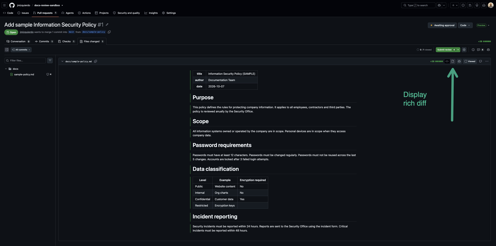

**As PDF or Word.**
Open the **Checks** tab, choose **Build documents**, and download `rendered-documents` from the **Artifacts** section.
It is a ZIP file with the PDF and DOCX of exactly this version.

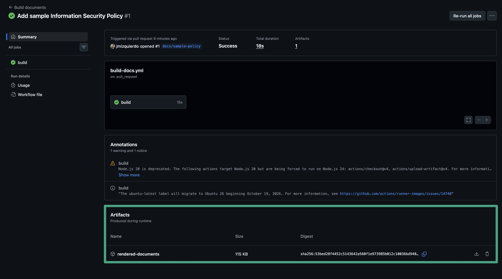

You can read the PDF or DOCX, but **write your comments on GitHub**, not in the file.
Comments in a downloaded file are lost.

## 3. Comment on a line

Go back to the source view in **Files changed** (the `<>` icon in the file header).
Each sentence is on its own line, with a line number on the left.

Hover over the line number and click the blue **+** that appears.
A comment box opens under the line.

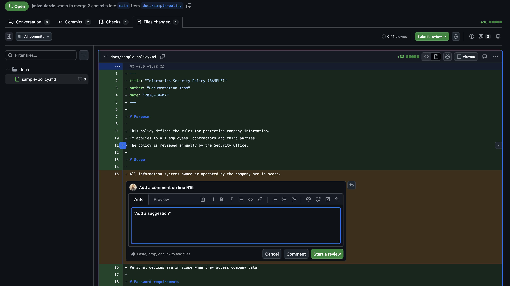

Write your comment and click **Start a review** (see step 6).

If you can't see the **+**, you are probably still in the rendered view.
Switch back to the source view.

## 4. Comment on several lines

Click the **+** on the first line and drag down to the last line, or click the first line number and Shift-click the last one.
The comment then covers the whole block, and its header says "Comment on lines +20 to +22".

In the example, the reviewer selected the three password rules to say "changed regularly" was too vague.

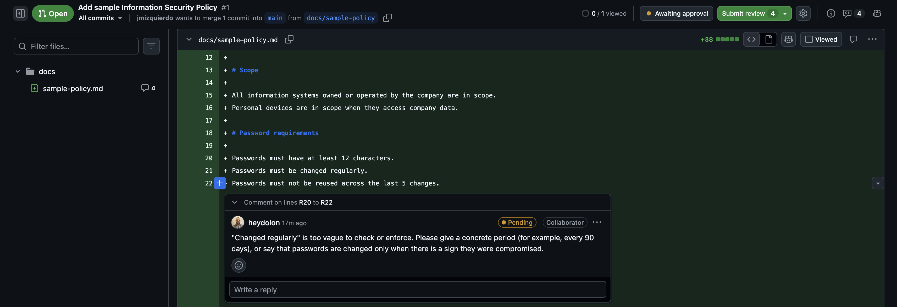

## 5. Suggest new wording

When you know exactly what the text should say, propose it instead of describing it.

1. Open a comment box on the line, as in step 3 (or on several lines, as in step 4).
2. Click the first icon in the comment toolbar, the document with a plus and minus sign (**Add a suggestion**). On a Mac you can also press Cmd+G.
3. GitHub inserts a block that starts with `` ```suggestion `` and contains the current text.
4. Edit the text **inside** the block so it reads the way it should.
5. Optionally, add a short explanation **above** the block.

**Only the new text goes inside the block.**
Whatever is inside replaces the original line(s) when the author commits the suggestion.
If you write an instruction there, such as "Highlight the tab in the picture", committing it would replace the line with your instruction.
In this screenshot from the review of this guide, committing the suggestion would have deleted the image:

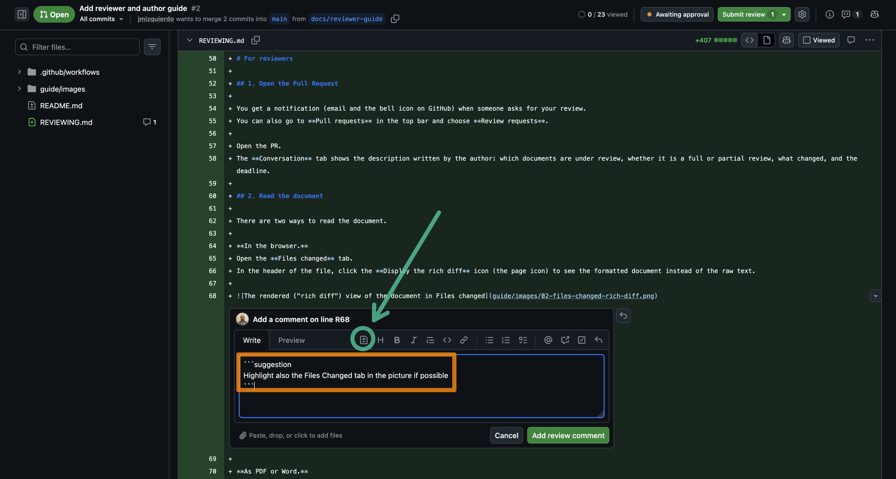

For requests like that, write a normal comment without a suggestion block.

In the example, the reviewer fixed the typo like this:

````markdown
Typo: "anually" should be "annually".

```suggestion
The policy is reviewed annually by the Security Office.
```
````

The author sees the old and new versions side by side and can accept the change with one click.

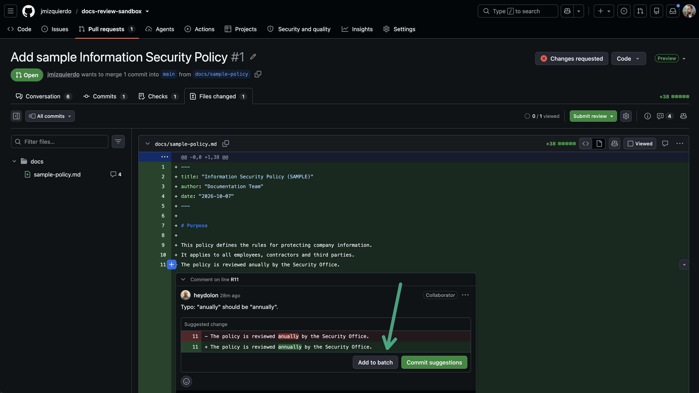

Use suggestions for wording, typos and small fixes.
Use a normal comment when you are asking a question or the fix needs the author's judgement.

## 6. Batch your comments with "Start a review"

When you write your first comment, click **Start a review** instead of **Add single comment**.
Your comments stay **Pending**, visible only to you, until you submit them all together.
This way the author gets one notification with all your feedback, not one per comment.

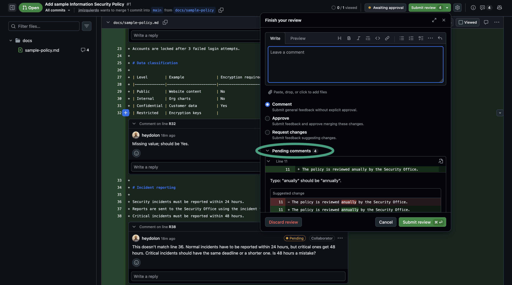

## 7. Submit your review with the right verdict

When you are done, click **Submit review** (called **Review changes** on some pages) in the top right.
Write a short summary and choose a verdict.

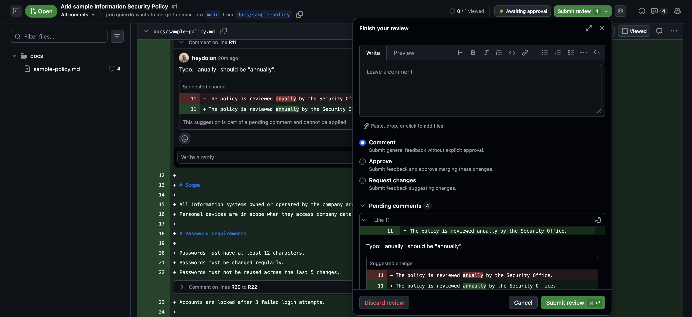

| Verdict | Use it when | Effect |
|---|---|---|
| **Comment** | You have questions or minor remarks and don't want to block or approve. | Doesn't change whether the PR can be merged. |
| **Request changes** | Something must be fixed before publishing. | Blocks the merge until you approve. |
| **Approve** | The document is ready to publish. | Counts as the approval needed to merge. |

In the example, the reviewer submitted four comments with **Request changes**.
The PR then showed the review and its threads on the **Conversation** tab, and merging was blocked.

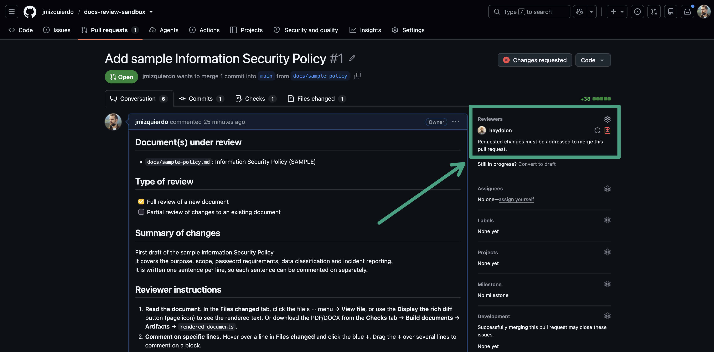

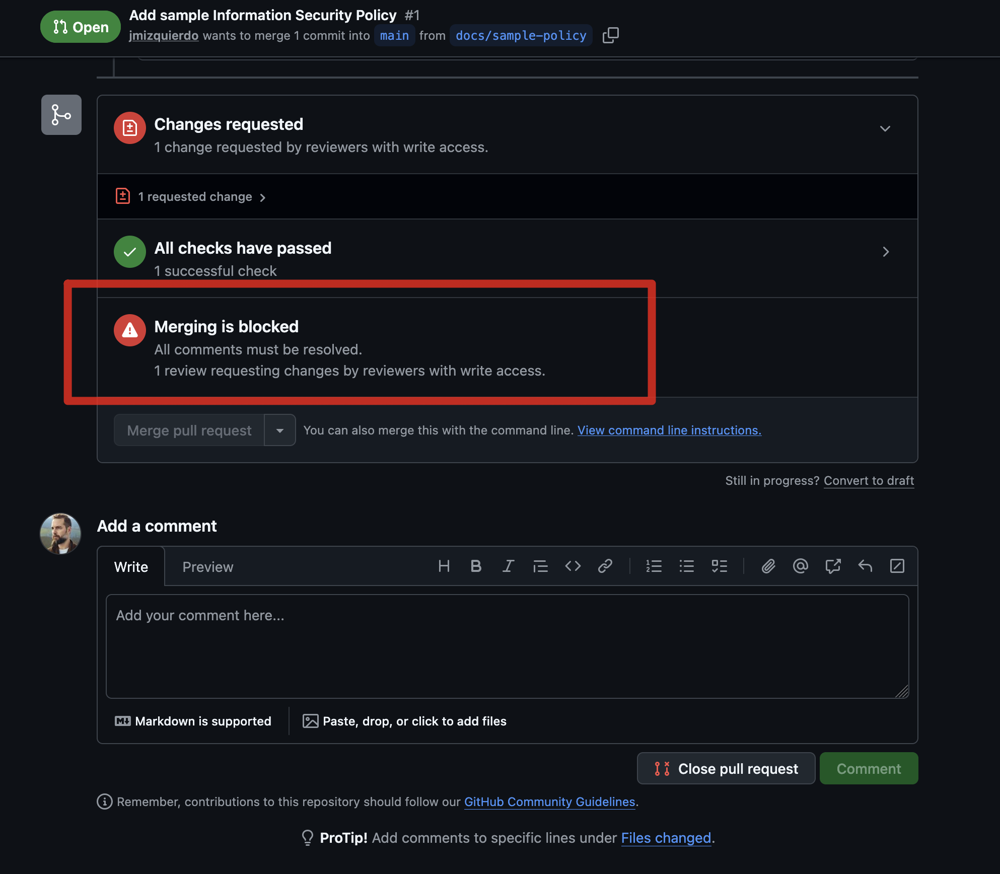

## 8. Re-review only what changed

When the author commits fixes, you get a new notification.
You don't need to read the whole document again.

In **Files changed**, open the **All commits** menu at the top left and choose **Changes since your last review**.
You see only the lines the author changed after your review.

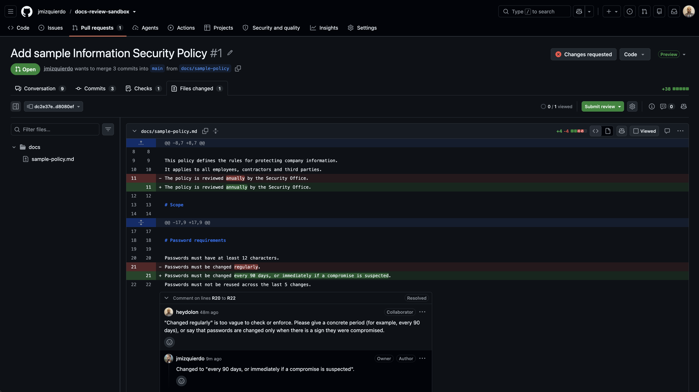

Check that every point was addressed, and look at the author's replies on the **Conversation** tab.
Then submit a new review.
If everything is fine, choose **Approve**.

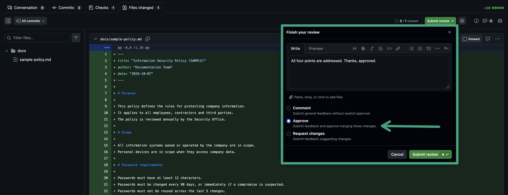

Your previous "Request changes" verdict stays in place until **you** approve.
The author fixing everything is not enough to unblock the merge.

# For authors

## 1. Create a branch

Never edit `main` directly; it is protected.
Each change, or each new document, gets its own branch with a descriptive name, for example `docs/sample-policy` or `docs/password-policy-update`.

1. On the **Code** tab of the repository, click the branch menu at the top left of the file list (it shows `main`).
2. Type the new branch name and click **Create branch docs/my-change from main**.
3. GitHub switches to your branch. Check that the branch menu now shows its name.

To work on your branch:

- **Change a document:** open the file and click the pencil icon (**Edit this file**).
- **Add a document:** click **Add file**, then **Create new file**, and type the name with its folder, for example `docs/password-policy.md`.

When you are done, click **Commit changes**, write a short description, and choose **Commit directly to the `docs/my-change` branch**.

If you start editing on `main` by mistake, GitHub won't let you commit there and offers **Create a new branch for this commit and start a pull request** instead, which is fine too.

## 2. Write one sentence per line

Put each sentence on its own line.
Markdown joins the lines of a paragraph when the document is rendered, so the PDF looks exactly the same.

```markdown
Security incidents must be reported within 24 hours.
Reports are sent to the Security Office using the incident form.
```

Why it matters:

- Reviewers can comment on **one sentence** instead of a whole paragraph.
- Suggestions replace one sentence and don't touch the others.
- When you change a sentence, the diff shows that sentence only.

Leave an empty line between paragraphs, and between a heading and its text.

## 3. Open the Pull Request with the template

After your first commit on the branch, GitHub shows a yellow banner with a **Compare & pull request** button.
If the banner is gone, open the **Pull requests** tab, click **New pull request**, choose **base: main** and **compare:** your branch, and click **Create pull request**.

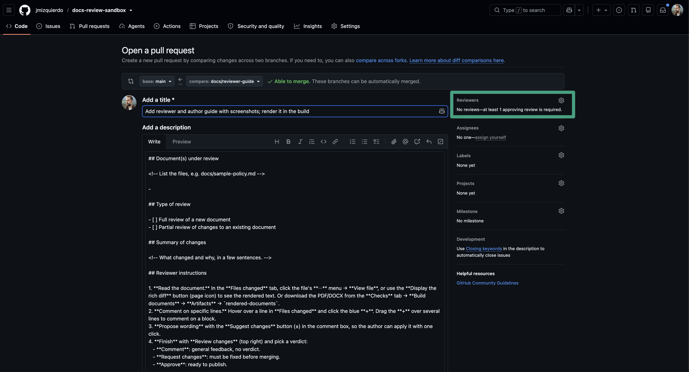

The description is pre-filled with our template.
Fill in every section:

- **Document(s) under review**: the file names.
- **Type of review**: full or partial (see the next step).
- **Summary of changes**: what changed and why.
- **Reviewer instructions**: leave them as they are, or add anything specific.
- **Review deadline**: a date.

Add the reviewers on the right under **Reviewers**, then click **Create pull request**.
See "How a review is requested" under "For reviewers" for the details.

A few minutes later the **Checks** tab shows the **Build documents** run.
When it is green, the PDF and DOCX are available to reviewers as the `rendered-documents` artifact.

## 4. Full review vs partial review

GitHub only lets reviewers comment on lines that are part of the PR's changes, plus a few lines around them.

- **New document (full review).** Every line is new, so every line can be commented on. This is what happened in the example.
- **Changes to an existing document (partial review).** Only the changed lines, and a little context around them, can be commented on. This is what you want most of the time.

**When you need a full review of an existing document** (for example, the yearly review), use the "add the whole file" trick, so that every line is new again:

1. Create a branch from `main` where the document is deleted, for example `review/base-sample-policy`. Create the branch as in step 1, open the document on it, choose **Delete file** from the **⋯** menu, and commit directly to that branch.
2. Create your working branch from `main` as usual (the document is still there), and make any changes.
3. Open the PR with **base** = `review/base-sample-policy` and **compare** = your working branch.
4. Every line of the document now appears as added, and reviewers can comment anywhere.
5. When the review is finished, close that PR without merging, and open a normal PR from your working branch into `main` to publish the result. Delete the `review/base-...` branch.

Tick **Partial review of changes** or **Full review of a new document** in the template so reviewers know what to expect.

## 5. Answer comments

Reply in the thread of each comment, even if only to say "Done".
If you disagree, explain why in the thread; the reviewer can then accept your explanation or insist.

In the example, the author answered the 48-hours comment before fixing it:

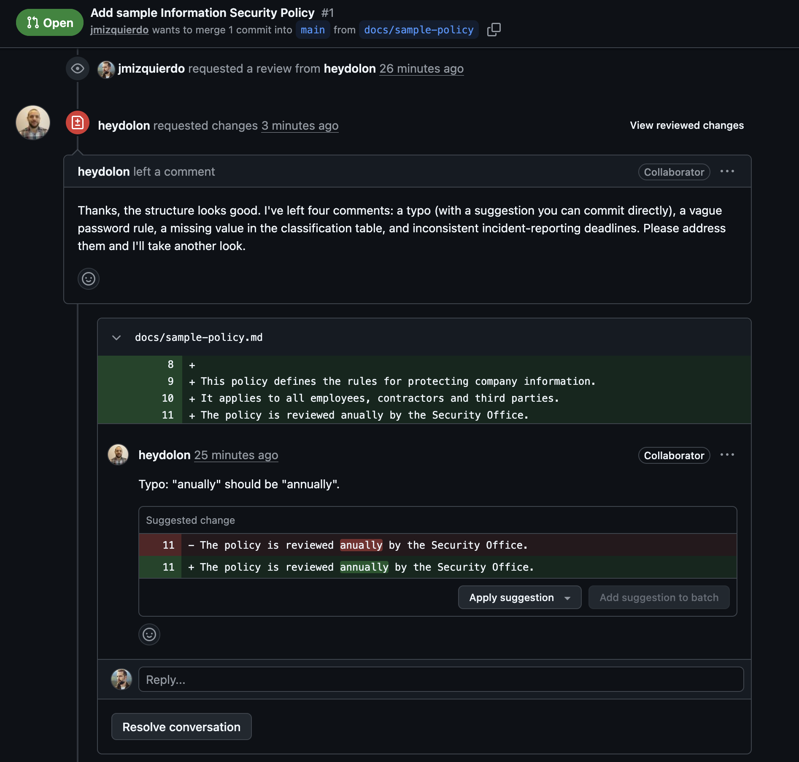

## 6. Commit suggestions

A suggestion comment shows the proposed text with buttons under it.

**One suggestion.**
Click **Commit suggestion** (or **Apply suggestion**), keep or edit the commit message, and click **Commit changes**.
GitHub creates the commit on your branch for you, and credits the reviewer as co-author.

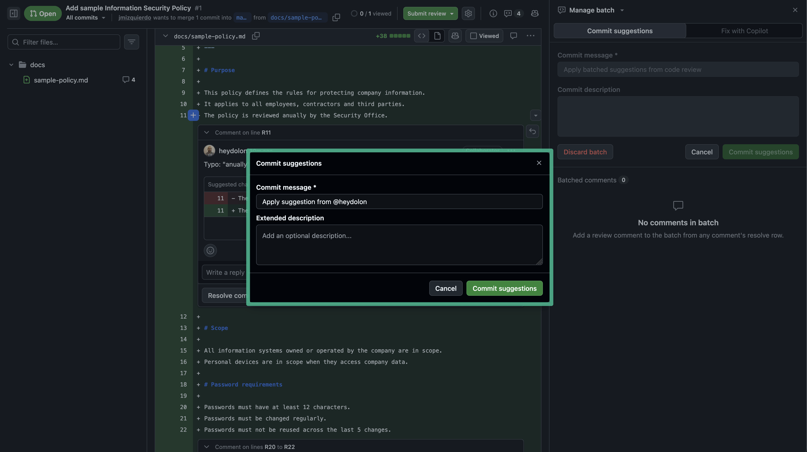

**Several suggestions at once.**
Click **Add suggestion to batch** (or **Add to batch**) on each suggestion you accept.
Then click **Commit suggestions** at the top of the page to create one commit with all of them.
This is better than one commit per typo.

## 7. Make your other fixes

Fix the comments that weren't suggestions directly on GitHub:

1. In the PR's **Files changed** tab, open the **⋯** menu in the file header and choose **Edit file**. This opens the file on your branch.
2. Make the changes.
3. Click **Commit changes**, describe the fix (for example "Address review: password rotation period, Restricted encryption, critical incident deadline"), and choose **Commit directly to** your branch.

The PR updates automatically, the PDF and DOCX are rebuilt, and the reviewers are notified.

## 8. Resolve the conversations

When a comment has been dealt with, click **Resolve conversation** at the bottom of its thread.
Resolved threads collapse, so everyone can see at a glance what is still open.

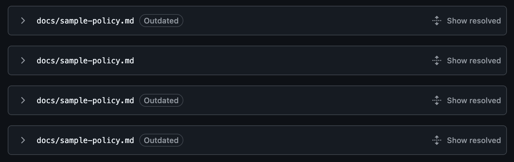

Click **Show resolved** to see the whole thread again:

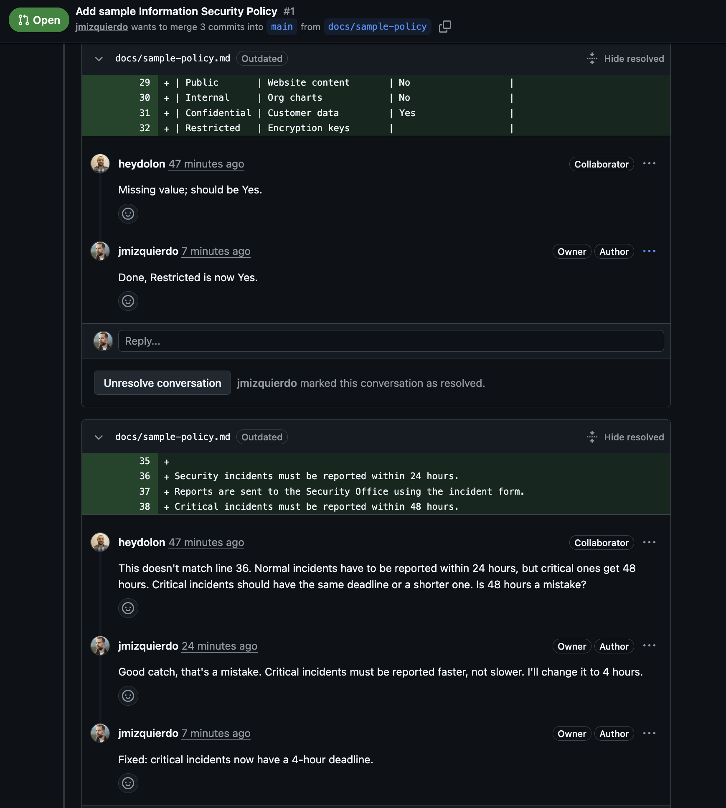

`main` requires every conversation to be resolved before merging.
Resolving is not the same as approval, though: while the reviewer's "Request changes" is in place, the PR stays blocked.

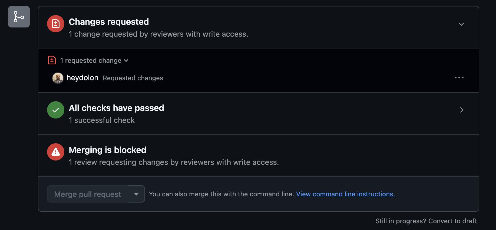

Ask the reviewer to look again; they re-review only what changed (see "For reviewers", step 8).

## 9. Merge

When the PR has the approval it needs, the checks are green, and every conversation is resolved, the merge box turns green.
Open the arrow next to the merge button, choose **Squash and merge**, and confirm.

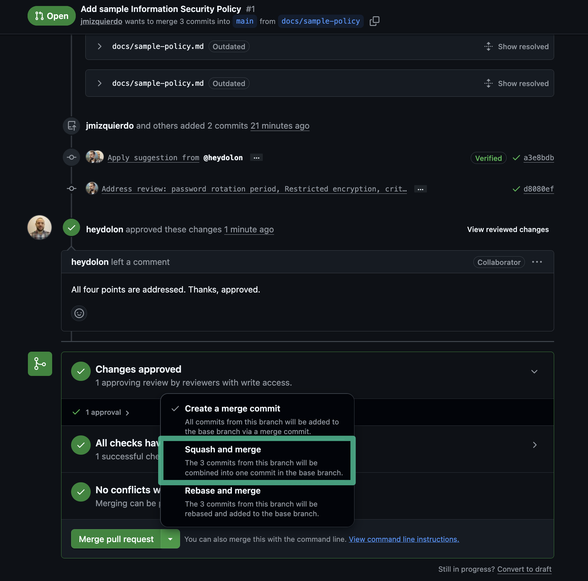

Squashing turns all the commits of the PR into one commit on `main`, so the history of the document reads as one entry per reviewed change.
After merging, click **Delete branch**.

## 10. Get the published files

Merging into `main` runs **Build documents** again.
To download the final, approved PDF and DOCX:

1. Open the **Actions** tab of the repository.
2. Click the latest **Build documents** run on `main`.
3. Download `rendered-documents` from the **Artifacts** section.

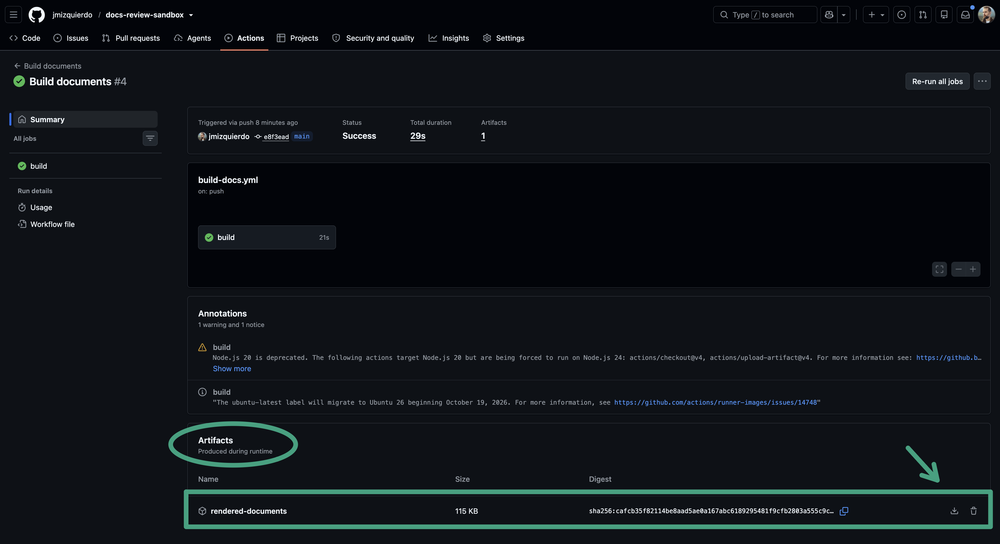

These are the files to publish or share.
Never edit them by hand: any change must go through a new PR.

Artifacts are kept for 90 days by default.
For long-term publishing, attach the files to a GitHub Release or copy them to the official location.

# FAQ

**I can't see the blue + button.**
You are probably in the rendered (rich diff) view.
Switch to the source view with the `<>` icon in the file header.
Also check that you are signed in and that you were added as a collaborator.
Lines far from any change can't be commented on in a partial review; see "Full review vs partial review".

**Can I review in Word?**
You can **read** the DOCX from the artifact, but comments and tracked changes in that file go nowhere.
Write your comments and suggestions on the PR.

**Where is the final PDF?**
**Actions** tab, latest **Build documents** run on `main`, **Artifacts** section, `rendered-documents`.

**Why are my comments marked "Pending"?**
You started a review and haven't submitted it yet.
Click **Submit review** and choose a verdict; until then, nobody else can see your comments.

**I fixed everything but the PR is still blocked.**
The reviewer's "Request changes" verdict stays until the reviewer approves.
Ask them to re-review.

**Why can't I approve the PR?**
GitHub doesn't let authors approve their own PRs.
Another person has to approve.

**What does "Outdated" mean on a comment?**
The line the comment was written on has changed since.
That usually means the author already acted on it.

**Can the author ignore a suggestion?**
Yes.
They should reply explaining why, then resolve the thread.

**A suggestion contains an instruction instead of new text. What do I do?**
Don't commit it, because it would replace the line with the instruction.
Do what it asks by hand, reply in the thread, and resolve it.

**Do I need to install anything?**
No.
Reviewers and authors do everything on the GitHub website.

\newpage

# Cheat sheet

**Reviewers**

| I want to... | Do this |
|---|---|
| Find PRs waiting for me | **Pull requests** in the top bar, then **Review requests** |
| Read the formatted document | **Files changed**, then the **Display the rich diff** icon |
| Get the PDF or DOCX | **Checks**, then **Build documents**, then **Artifacts**, then `rendered-documents` |
| Comment on a sentence | Source view, hover over the line number, click the blue **+** |
| Comment on several lines | Drag the **+** from the first to the last line |
| Propose new wording | In the comment box, click **Add a suggestion** (first toolbar icon) or press Cmd+G, then edit the text inside the block |
| Send all comments together | **Start a review** on the first comment, then **Submit review** at the end |
| Block until fixed | Submit with **Request changes** |
| Accept the document | Submit with **Approve** |
| See only what changed since my review | **Files changed**, **All commits** menu, **Changes since your last review** |

**Authors**

| I want to... | Do this |
|---|---|
| Start a change | **Code** tab, branch menu (shows `main`), type a name, **Create branch** |
| Write reviewable text | One sentence per line, empty line between paragraphs |
| Ask for a review | Open a PR, fill in the template, add reviewers |
| Get a full review of an existing document | The "add the whole file" trick: PR against a branch where the file is deleted |
| Accept one suggestion | **Commit suggestion**, then **Commit changes** |
| Accept several suggestions | **Add suggestion to batch** on each, then **Commit suggestions** |
| Fix other comments | **Files changed**, file **⋯** menu, **Edit file**, then **Commit changes** to your branch |
| Close a comment | Reply, then **Resolve conversation** |
| Publish | After approval, **Squash and merge**, then **Delete branch** |
| Get the published files | **Actions**, latest **Build documents** run on `main`, **Artifacts** |

**Rules on `main`:** at least 1 approval, all conversations resolved, no direct changes.
